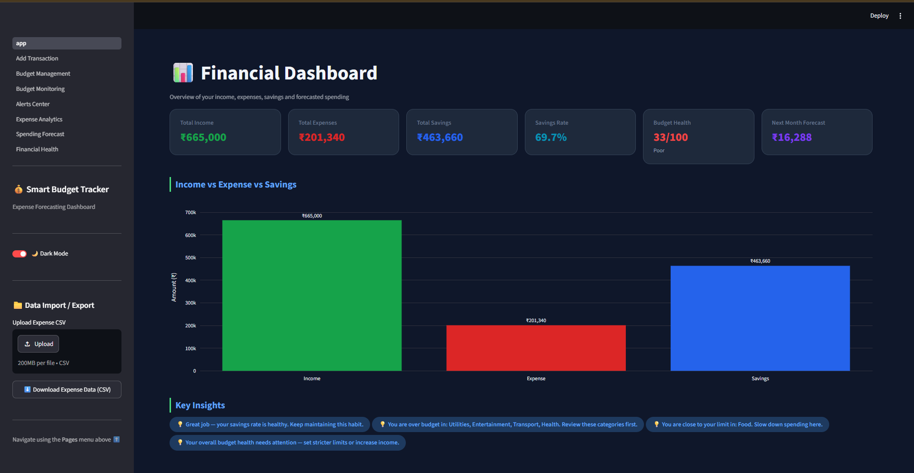
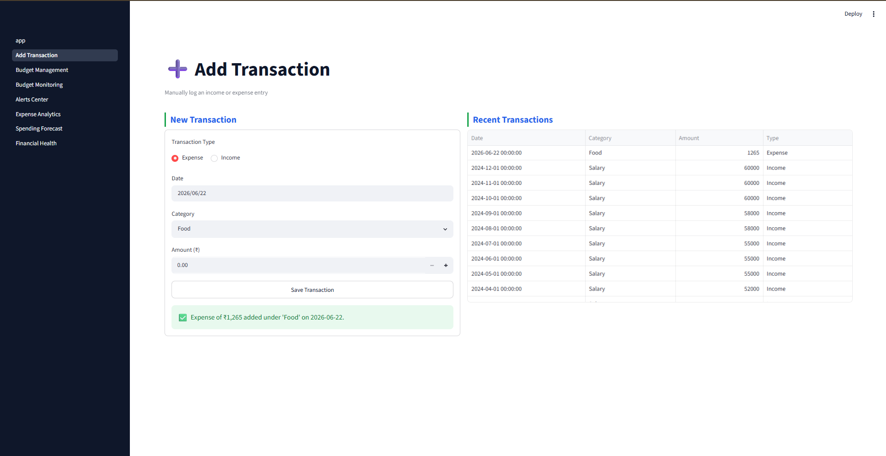
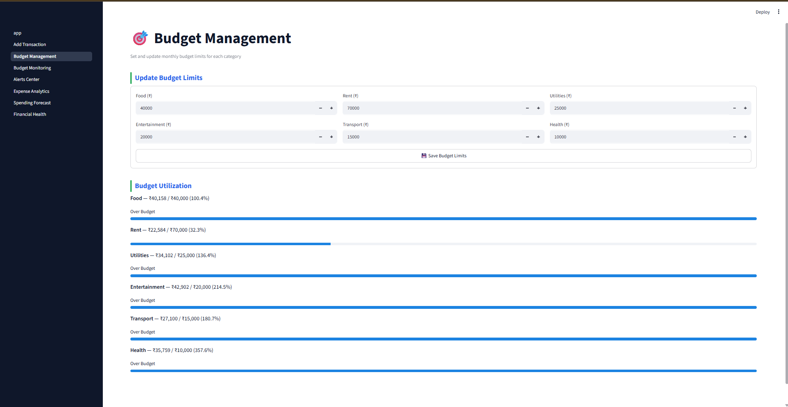
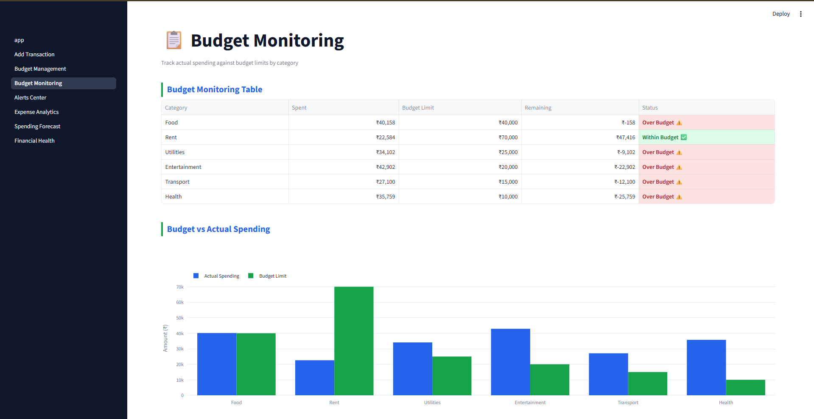
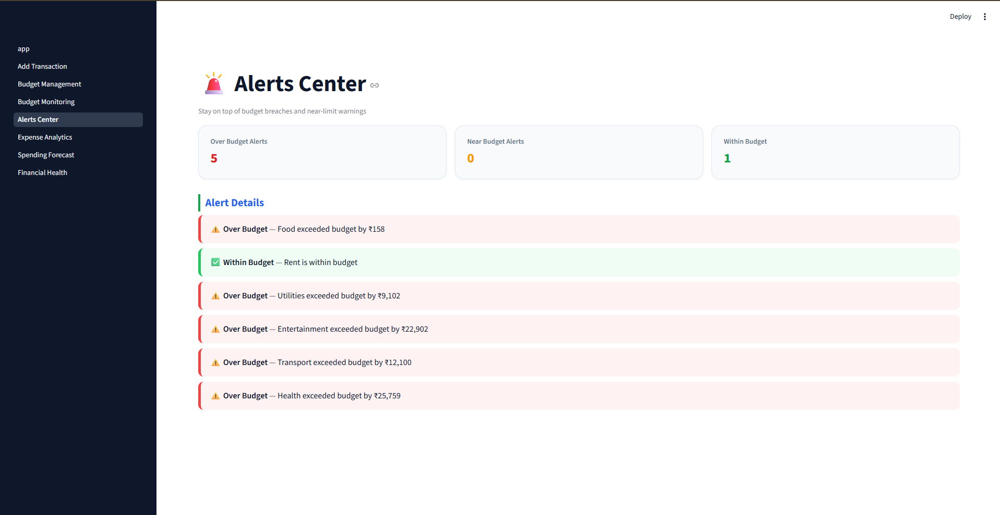
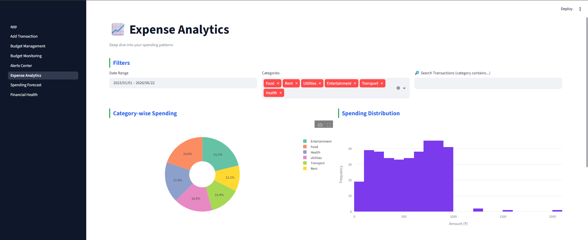
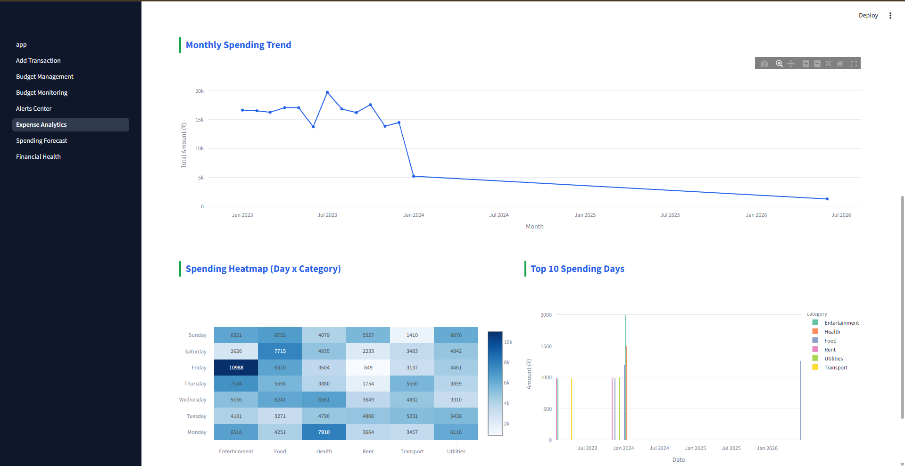
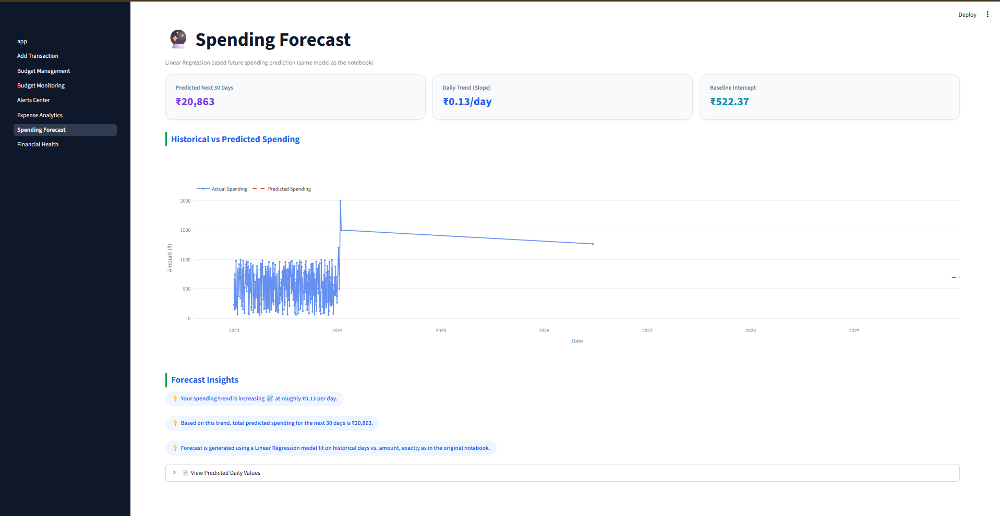
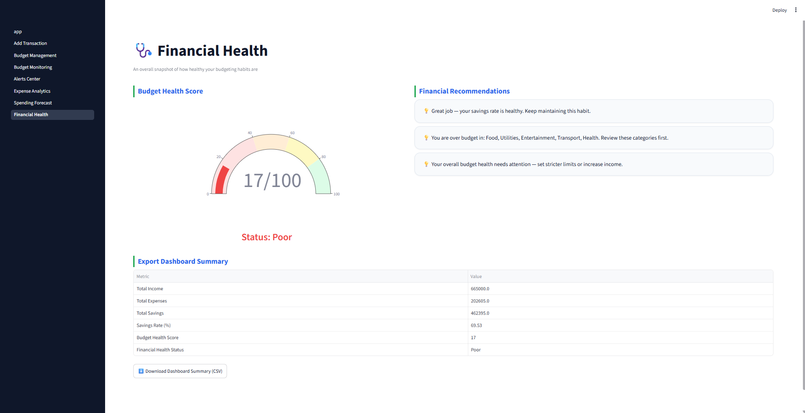

# Smart Personal Budget Tracker & Expense Forecasting


A comprehensive personal finance management application built using **Python, Streamlit, Data Analytics, and Machine Learning**. The application enables users to track income and expenses, manage budgets, receive spending alerts, analyze financial behavior, and forecast future spending using Linear Regression.

## 📋 Project Overview

The Smart Personal Budget Tracker provides:

* 💰 Income & Expense Tracking
* 📊 Interactive Financial Dashboard
* 🎯 Budget Management & Monitoring
* 🚨 Budget Alerts System
* 📈 Expense Analytics & Visualizations
* 🤖 Machine Learning-Based Spending Forecast
* ❤️ Financial Health Assessment
* 📁 CSV Import & Export Support
* 🌙 Dark Mode Support

## 📸 Application Preview

### 🏠 Financial Dashboard



### ➕ Add Transaction



### 🎯 Budget Management



### 📋 Budget Monitoring



### 🚨 Alerts Center



### 📊 Expense Analytics



### 📈 Spending Trends & Heatmap



### 🔮 Spending Forecast



### ❤️ Financial Health Assessment



## 📁 Project Structure

```text
Smart-Personal-Budget-Tracker/
│
├── app.py                         # Streamlit Application
├── PersonalBudgetTracker.ipynb    # Original Notebook
├── requirements.txt
├── README.md
│
└── screenshots/
    ├── dashboard.png
    ├── add_transaction.png
    ├── budget_management.png
    ├── budget_monitoring.png
    ├── alerts_center.png
    ├── expense_analytics_1.png
    ├── expense_analytics_2.png
    ├── spending_forecast.png
    └── financial_health.png
```

## 🚀 Running the Streamlit Application

### Install Dependencies

```bash
pip install -r requirements.txt
```

### Run the Application

```bash
streamlit run app.py
```

Open your browser at:

```text
http://localhost:8501
```

## 📊 Key Features

### 💰 Financial Dashboard

* Total Income Tracking
* Expense Monitoring
* Savings Calculation
* Savings Rate Analysis
* Budget Health Score
* Next Month Spending Forecast

### ➕ Transaction Management

* Add Income Transactions
* Add Expense Transactions
* Category-wise Tracking
* Transaction History

### 🎯 Budget Management

* Set Budget Limits
* Monitor Budget Utilization
* Category-wise Budget Tracking

### 🚨 Budget Alerts

* Over-Budget Notifications
* Near-Limit Warnings
* Financial Recommendations

### 📈 Expense Analytics

* Category-wise Spending Analysis
* Spending Distribution
* Monthly Trends
* Spending Heatmaps
* Top Spending Days

### 🤖 Spending Forecast

* Linear Regression Model
* Future Spending Prediction
* Historical vs Predicted Analysis

### ❤️ Financial Health Assessment

* Budget Health Score (0-100)
* Financial Status Classification
* Personalized Recommendations

## 📈 Technology Stack

* Python
* Streamlit
* Pandas
* NumPy
* Scikit-Learn
* Plotly
* Matplotlib
* Seaborn
* Linear Regression

## 👨‍💻 Author

**Ajinkya Mariche**

GitHub: https://github.com/Ajinkya7890

**Ishan Pote**

Github: https://github.com/ishanpote
